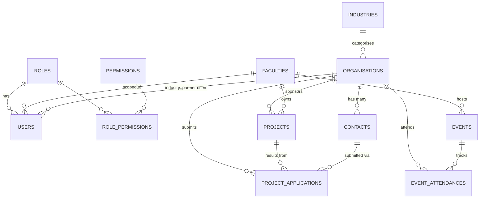

# QUT Professional Services CRM — Database Schema Design

Notes on the schema in `schema.sql` — what each table is for, why it's designed the way it is, and how it connects to the user stories.

---

## 1. Entities at a glance

| Entity | Purpose | User stories |
|---|---|---|
| `users` | Authentication + role assignment | PT-2, AD-1 |
| `roles`, `permissions`, `role_permissions` | RBAC (admin / course organiser / industry partner) | PT-2 |
| `faculties`, `industries` | Lookup tables for grouping and filtering | CO-2 |
| `organisations` | Industry partner records + approval workflow | IP-1, AD-2, CO-1, CO-2, CO-6 |
| `contacts` | Named contacts per organisation | IP-1, CO-1 |
| `projects` | Capstone / undergrad / postgrad projects | CO-4, CO-5 |
| `project_applications` | Partner-submitted EOIs before admin review | IP-2, AD-2 |
| `events` | Showcases, expos, scholar programs, meetings | (Tab 4) |
| `event_attendances` | Links organisations to events they attended | (Tab 4) |
| `audit_log` | Full change history (who changed what, when) | (audit) |

---

## 2. ER Diagram



---

## 3. Design decisions

### 3.1 One organisation per project (with a note on CO-5)
Each project has a single `organisation_id` FK. This works for most cases but conflicts with CO-5 which says a project can have multiple partners. If that turns out to be a real requirement, we'd swap the FK for a junction table:

```sql
CREATE TABLE project_partners (
    project_id      UUID NOT NULL REFERENCES projects(id),
    organisation_id UUID NOT NULL REFERENCES organisations(id),
    role            VARCHAR(50),
    PRIMARY KEY (project_id, organisation_id)
);
```

Worth clarifying with the team before Phase 2 since it's easy to change now and annoying later.

### 3.2 Two status fields on organisations
- `partnership_status` — where the partner sits in the CRM lifecycle: `prospect`, `active`, `completed`, `inactive` (CO-6)
- `submission_status` — whether an admin has approved their registration: `pending`, `approved`, `rejected`, `archived` (IP-1, AD-2)

They're separate because they mean different things. A partner can be approved but still a prospect (they registered but haven't done a project yet). Collapsing them into one field would get messy fast.

### 3.3 Project applications as their own table
EOIs (IP-2) aren't projects — they're proposals that may or may not go anywhere. Keeping them in their own table means:
- Admins have a clear review queue (AD-2)
- Rejected EOIs stay on record
- When an EOI is approved, `resulting_project_id` links it forward to the created project

### 3.4 RBAC with a permissions table
Three roles cover the MVP: `admin`, `course_organiser`, `industry_partner`. The `role_permissions` join table is there for later — if other faculties come on board you can add more granular permissions (e.g. read-only access to specific resources) without touching the schema.

`users.faculty_id` is nullable but set for course organisers so queries can eventually be scoped by faculty.

### 3.5 Soft deletes
Every business table has `deleted_at` (NULL = live record). Indexes are partial (`WHERE deleted_at IS NULL`) to keep them fast. Nothing gets permanently deleted — records stay in the DB and can be restored or audited.

### 3.6 Audit log
Changes are written to `audit_log` with old + new values as JSONB. This survives soft deletes, is queryable by record or by user, and gives you a full history of what changed. Recommend writing from the API layer rather than DB triggers so you can capture the HTTP user's ID and IP address.

### 3.7 UUID primary keys
UUIDs avoid collisions when importing data from multiple Excel spreadsheets, and don't leak record counts in URLs. Small storage overhead at this scale, not worth worrying about.

### 3.8 Indexing
The main query patterns are predictable: filter by `(year, semester)`, by `industry_id`, by `partnership_status`, search by name. The schema covers these with:
- Composite index on `projects (year, semester)` for intake queries
- Trigram indexes on `organisations.name` and `projects.title` for fuzzy search (CO-2)
- Partial unique index on `contacts (organisation_id) WHERE is_primary` — one primary contact per org

---

## 4. User story → table mapping

| Story | Tables involved |
|---|---|
| **AD-1** View all data | All — admin role has read access to everything |
| **AD-2** Approve / reject / archive | `organisations.submission_status`, `project_applications.application_status` |
| **CO-1** Create partner | INSERT `organisations` + `contacts` |
| **CO-2** Search/filter partners | Indexes on `organisations.name`, `industry_id`, `partnership_status`; joins to `projects` |
| **CO-4** Create / update projects | `projects` CRUD |
| **CO-5** Link project to partner | `projects.organisation_id` — see note 3.1 |
| **CO-6** Partnership status | `organisations.partnership_status` |
| **IP-1** Register org + primary contact | INSERT `organisations` (pending) + `contacts` (is_primary=true) + `users` (industry_partner role) |
| **IP-2** Submit project EOI | INSERT `project_applications` (pending) |
| **PT-2** RBAC | `roles`, `permissions`, `role_permissions`, `users.role_id` |
| **PT-3** Separate linked entities | All entities are separate tables with FK relationships |
| **PT-4** Sorting/filtering | Indexes on every commonly-filtered column |

---

## 5. Analytics queries

```sql
-- Projects per semester / year
SELECT * FROM v_intake_summary;

-- New vs returning partners per intake
SELECT year, semester, new_partners, returning_partners FROM v_intake_summary;

-- Industry breakdown
SELECT industry_name, COUNT(*) AS partner_count, SUM(total_projects) AS project_count
FROM v_organisation_stats
GROUP BY industry_name
ORDER BY project_count DESC;

-- Most active partners (last 3 years)
SELECT * FROM v_most_active_partners_3yr LIMIT 20;

-- Most active partners in a specific intake
SELECT o.name, COUNT(*) AS projects
FROM organisations o
JOIN projects p ON p.organisation_id = o.id
WHERE p.year = 2025 AND p.semester = 'S1' AND p.deleted_at IS NULL
GROUP BY o.id, o.name
ORDER BY projects DESC;
```

---

## 6. Open questions

1. **CO-5** — single partner per project or many-to-many? Needs confirming before Phase 2.
2. **Multi-faculty rollout** — do course organisers see only their faculty's data or everything? Affects whether we need row-level security.
3. **Historical data migration** — 7-8 years of Excel data will have inconsistent labels and gaps. Probably needs a staging table and a cleanup pass before loading into the real schema.
4. **Audit log writer** — API layer is better than DB triggers here (can capture the logged-in user's ID and IP).
5. **Soft-delete cascades** — when an org is soft-deleted, what happens to its projects and contacts? Probably block deletion if active projects exist, otherwise cascade to contacts.
6. **Contact email uniqueness** — no unique constraint on `contacts.email` since a person could work across two orgs. Worth confirming.

---

## 7. Out of scope for MVP

- Student / supervisor assignments on projects
- Contact-level event attendance (current schema tracks at org level)
- File attachments
- Email / notification history
- Refresh tokens
