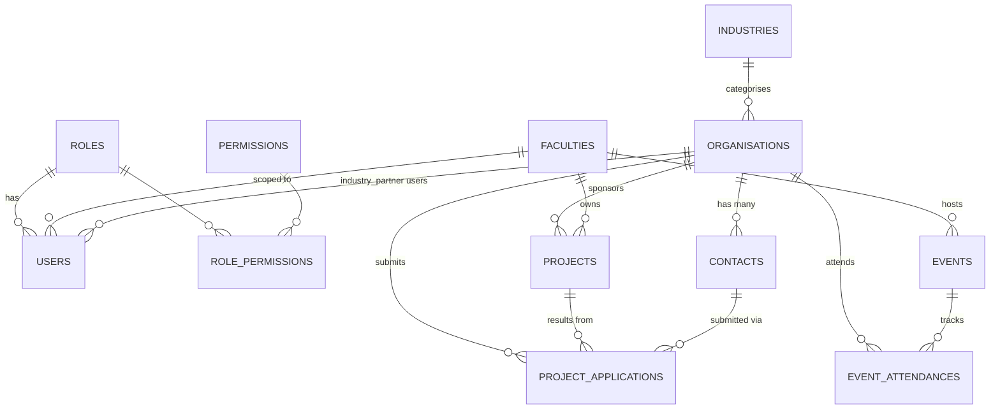

# QUT Professional Services CRM — Database Schema Design

This document explains the schema in `schema.sql` — the entities, relationships, design decisions, and how each user story maps to the data model.

---

## 1. Entities at a glance

| Entity | Purpose | Key user stories |
|---|---|---|
| `users` | Authentication + role assignment | PT-2, AD-1 |
| `roles`, `permissions`, `role_permissions` | RBAC layer (admin / course organiser / industry partner) | PT-2 |
| `faculties`, `industries` | Lookup tables for grouping and reporting | CO-2 |
| `organisations` | Industry partner master record + approval workflow | IP-1, AD-2, CO-1, CO-2, CO-6 |
| `contacts` | Multiple named contacts per organisation | IP-1, CO-1 |
| `projects` | Capstone / undergrad / postgrad projects | CO-4, CO-5 |
| `project_applications` | Partner-submitted EOIs awaiting admin review | IP-2, AD-2 |
| `events` | Showcases, expos, scholar programs, meetings | (Tab 4) |
| `event_attendances` | Org-level attendance link to events | (Tab 4) |
| `audit_log` | Immutable change history (who, what, when) | (Q7 — audit) |

---

## 2. Entity-Relationship diagram



---

## 3. Key design decisions

### 3.1 One organisation per project (with caveat)
You confirmed each project has exactly one industry partner, so `projects.organisation_id` is a non-null FK. **However, user story CO-5 says "link a project to one or more industry partners,"** which contradicts this.

If CO-5 turns out to be the source of truth, swap the FK for a junction table:

```sql
CREATE TABLE project_partners (
    project_id      UUID NOT NULL REFERENCES projects(id),
    organisation_id UUID NOT NULL REFERENCES organisations(id),
    role            VARCHAR(50),                     -- 'lead', 'co-sponsor', etc
    PRIMARY KEY (project_id, organisation_id)
);
```
This is a low-risk migration (one table added, FK dropped from `projects`) and worth confirming with the team early.

### 3.2 Two distinct status fields on `organisations`
- **`partnership_status`** (`prospect` / `active` / `completed` / `inactive`) — CRM lifecycle state (CO-6).
- **`submission_status`** (`pending` / `approved` / `rejected` / `archived`) — admin moderation state for partner self-registration (IP-1, AD-2).

These are orthogonal: a partner can be `approved` (admin let them in) and `prospect` (no project yet). Keeping them separate avoids overloading one column with mixed concerns.

### 3.3 Project applications as a first-class entity
EOIs (IP-2) are not projects — they're proposals that may or may not become projects. Modelling `project_applications` separately gives you:
- A clean approval queue for admins (AD-2).
- An audit trail of rejected/archived proposals.
- A `resulting_project_id` link so an approved EOI traces forward to the real project.

### 3.4 RBAC: roles + permissions + role_permissions
- For the IT-faculty MVP, three roles (`admin`, `course_organiser`, `industry_partner`) cover everything.
- The `permissions` table is wired up for later — when other faculties join you can add resource-scoped permissions (e.g. `projects:read:faculty=IT`) without schema changes.
- `users.faculty_id` is nullable but populated for course organisers; this lets you eventually scope queries by faculty.

### 3.5 Soft deletes everywhere
Every business table has `deleted_at TIMESTAMPTZ` (NULL = live). All hot-path indexes are partial (`WHERE deleted_at IS NULL`) to keep them small and fast. Deleted rows stay in the DB for audit/restore but are filtered out by the application layer.

### 3.6 Audit log as a separate append-only table
Rather than `created_by`/`updated_by` alone, every change is also written to `audit_log` with old + new values as JSONB. This:
- Survives soft deletes and hard rollbacks.
- Is queryable by record (`WHERE table_name='projects' AND record_id=?`) or by user.
- Should be populated via a trigger or via the API layer (recommend the API layer — easier to capture the actor's user ID and IP).

### 3.7 UUID primary keys
- Safer to merge data from multiple sources during migration (no PK collisions).
- Easier to expose in URLs without leaking volume info.
- Slight storage overhead vs `bigserial` — acceptable at this scale.

### 3.8 Indexing for the analytics workload
The dashboard queries are predictable: filter by `(year, semester)`, by `industry_id`, by `partnership_status`, sort partners by name, search by partial text. The schema has:
- Composite index on `projects (year, semester)` for intake queries.
- Trigram (`gin_trgm_ops`) indexes on `organisations.name` and `projects.title` for fast fuzzy search (CO-2).
- Partial unique index on `contacts (organisation_id) WHERE is_primary` to enforce one-primary-per-org.

---

## 4. Mapping user stories → tables

| Story | Tables / columns involved |
|---|---|
| **AD-1** View all data | All — admin role has read access to every table |
| **AD-2** Approve / reject / archive | `organisations.submission_status`, `project_applications.application_status` |
| **CO-1** Create partner | INSERT `organisations` + `contacts` |
| **CO-2** Search/filter partners | Indexes on `organisations.name`, `industry_id`, `partnership_status`; joins to `projects` |
| **CO-4** Create / update projects | `projects` (full CRUD) |
| **CO-5** Link project to partner(s) | `projects.organisation_id` — see note 3.1 above |
| **CO-6** Partnership status | `organisations.partnership_status` |
| **IP-1** Register org + primary contact | INSERT `organisations` (status=pending) + `contacts` (is_primary=true); creates corresponding `users` row with role `industry_partner` |
| **IP-2** Submit project EOI | INSERT `project_applications` (status=pending) |
| **PT-1** Run in Docker | Out of schema scope — but UUID PKs and TIMESTAMPTZ make this portable across environments |
| **PT-2** RBAC | `roles`, `permissions`, `role_permissions`, `users.role_id` |
| **PT-3** Separate but linked entities | All entities are separate tables with FKs — covered |
| **PT-4** Sorting/filtering/structured display | Indexes on every commonly-filtered column |

---

## 5. Sample analytics queries

These map directly to the analytics requirements in section 5 of your brief.

```sql
-- "Number of projects run per semester / year"
SELECT * FROM v_intake_summary;

-- "Split of new vs returning partners per intake"
SELECT year, semester, new_partners, returning_partners
FROM v_intake_summary;

-- "Industry breakdown"
SELECT industry_name, COUNT(*) AS partner_count, SUM(total_projects) AS project_count
FROM v_organisation_stats
GROUP BY industry_name
ORDER BY project_count DESC;

-- "Most active industry partners over the last 3 years"
SELECT * FROM v_most_active_partners_3yr LIMIT 20;

-- "Most active partners who provided projects in Sem 1, 2025"
SELECT o.name, COUNT(*) AS projects_in_intake
FROM organisations o
JOIN projects p ON p.organisation_id = o.id
WHERE p.year = 2025 AND p.semester = 'S1' AND p.deleted_at IS NULL
GROUP BY o.id, o.name
ORDER BY projects_in_intake DESC;
```

---

## 6. Open questions / next decisions

1. **Resolve CO-5 contradiction** — single partner per project (current schema) or many-to-many? Cheap to change now, painful later.
2. **Multi-faculty rollout** — when the system extends beyond IT, do course organisers see only their faculty's data, or everything? This affects whether RBAC needs row-level scoping (Postgres RLS is a clean way to do it).
3. **Historical data migration** — the 7–8 years of Excel data will likely have inconsistent industry labels, missing semester info, free-text project types. Plan for a staging table + cleanup pass before loading into `organisations`/`projects`.
4. **Audit log writer** — recommend writing audits from the API layer (so you capture actor + IP) rather than DB triggers (which can't see the HTTP context).
5. **Soft-delete cascade rules** — when an organisation is soft-deleted, what happens to its projects and contacts? Current schema doesn't auto-cascade; the API should decide (probably "block deletion if projects exist; otherwise soft-delete contacts too").
6. **Email uniqueness on contacts** — currently no unique constraint on `contacts.email` (a person could legitimately work at two orgs). Confirm.

---

## 7. What's deliberately NOT in this MVP schema

- Students/supervising staff on projects (Q4 — out of scope, easy to add via `project_assignments`).
- Individual-level event attendance (Q5 — replace `event_attendances.organisation_id` with a `contact_id` later, or add both).
- File attachments (project docs, EOI PDFs).
- Email/notification log.
- API tokens / refresh tokens (auth implementation detail — keep separate from this schema if you use a managed auth service).
